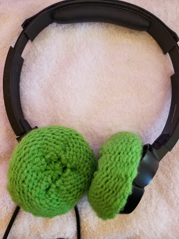

> Learn to make your own super comfy loom knitted gaming headset covers!

 I love my Turtle Beach headset but the foam cover on the earpieces was falling apart. And when I say falling apart, I mean was nearly non-existent. My husband was having the same problem with his. Being the avid DIYer that I am, I thought, "I can knit some covers for us!"

I took to the internet in search of a pattern only to find a bunch of crochet patterns and a couple of needle patterns but no loom knitting patterns for headphone covers. Hmm. Oh well. I wasn't going to let a lack of patterns stop me! I'd been watching tons of YouTube videos on loom knitting projects and thought I'd gathered enough info to come up with my own solution.

Since I'm still fairly new to loom knitting I'm sure the more experienced out there could come up with a more elegant solution, but this gets the job done and my husband and I love our new headphone covers!

**Knitting Loom:** 24-peg (5/8" gauge) small round loom. [Darice blue round loom](https://www.amazon.com/Darice-1171-58-Round-Plastic-Knitting/dp/B001GAHFHY/ref=sr_1_1?ie=UTF8&qid=1510838074&sr=8-1&keywords=darice+knitting+looms&dpID=41QhN2ne2QL&preST=_SX300_QL70_&dpSrc=srch) used in the example.

**Yarn:** 21 yards #4 worsted weight 100% acrylic. [Red Heart Super Saver, Spring Green](https://www.amazon.com/Red-Heart-Super-Saver-Economy/dp/B000I6FA8S/ref=sr_1_4_m?s=arts-crafts&ie=UTF8&qid=1510838139&sr=1-4&keywords=red%2Bheart%2Bsuper&dpID=517IJLlW0GL&preST=_SY300_QL70_&dpSrc=srch&th=1) used in the example.

**Gauge:** Not critical for this pattern.

**Notions:**
* Loom hook. I love the [Authentic Knitting Board Ergonomic Knit Hook](https://www.amazon.com/Authentic-Knitting-Board-Ergonomic-Knit/dp/B009VKFHJY/ref=sr_1_4?s=arts-crafts&ie=UTF8&qid=1510838421&sr=1-4&keywords=loom+hook&dpID=41A14yBmYvL&preST=_SY300_QL70_&dpSrc=srch).
* Scissors
* Tapestry needle

**Abbreviations:**
* CO = Cast on. This pattern uses the [drawstring cast on](https://youtu.be/i9SAgT-l29k).
* Rnd(s) = Round(s)
* k = u-wrap knit stitch
* BO = Bind off. This pattern uses the [Finish the Hat Flat bind-off](https://youtu.be/QwY9MN7s9Bc) from loomahat.com.
Pattern Notes: This pattern is sized for the Turtle Beach Ear Force PLa Gaming Headset.  I found that I only needed to knit 12 rows to achieve the proper size. Many gaming headsets are similar in size but if your is different, you may want to measure your ear piece for custom sizing.

Though this pattern uses the knit stitch, you'll turn the finished product inside out so that the purl side is facing out once the cover is fitting on the headphone ear piece.

## DIRECTIONS

CO using the the [drawstring cast on](https://youtu.be/i9SAgT-l29k) in the round.

Rnds 1-12: k across

BO using the [Finish the Hat Flat bind-off](https://youtu.be/QwY9MN7s9Bc).

Pull working yarn (yarn on BO end) to tighten (it should be completely closed with no hole) and weave in the ends.

**Finishing**

Turn knitting inside out (purl side should be facing you).

Gently pull the yarn at the end of the draw string CO to form a cup like shape.

Fit cover on your headphones and pull yarn to finish tightening it around your headphone ear piece.

Once fitted to your liking, weave in the end of your yarn around the edges (while cover is still on the headphone ear piece). This helps it stay on.!